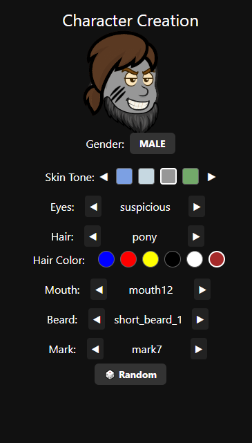

# 🧙‍♂️ Loot Reaver

[](https://expo.dev)
[](https://reactnative.dev)
[](LICENSE)
[](https://prettier.io)

**Loot Reaver** is a stylized 2D mobile/web RPG with modular characters, scalable dungeon progression, loot-based growth, and fast turn-based combat. Built with modern web technologies using Expo and React Native.

---

## 📸 Preview

> 

---

## 🔧 Tech Stack

- **Frontend**: [React Native](https://reactnative.dev/) + [Expo](https://expo.dev/)
- **Navigation**: [Expo Router](https://expo.github.io/router/)
- **Backend (planned)**: [NestJS](https://nestjs.com/)
- **Assets**: modular sprites (head, hair, beard, etc.)
- **Tooling**:
    - Prettier (`@trivago/prettier-plugin-sort-imports`)
    - ESLint
    - GitHub for version control

---

## 🚀 Getting Started

### 1. Clone the repository

```bash
git clone https://github.com/alexandergm90/loot-reaver.git
cd loot-reaver
```

### 2. Install dependencies

```bash
npm install
# or
yarn install
```

### 3. Start the app

```bash
npx expo start
```

This opens Expo Dev Tools in your browser. You can preview the app on:

- 📱 Android emulator
- 🍏 iOS simulator (macOS)
- 📲 Expo Go on physical device

### 🎨 Development Notes

- Register creation uses modular layering (head, eyes, mouth, hair, etc.)
- Hair style and hair color are selected independently
- Skin tone is chosen via a horizontal carousel of 12 tones
- All assets are mapped in characterAssets
- Code formatting is handled with Prettier:

```bash
npm run format
```

### 🛠 Planned Features

✅ Register creation with animation

🔜 Scalable dungeon system with backend-generated combat logs

🔜 PvE loot scaling and gear score system

🔜 Inventory and equipment management

🔜 PvP combat & ladder

🔜 Account linking (Google, Apple, Facebook)

🔜 Guild system, leaderboards, titles

### 📝 License

Copyright © 2025 Manea Alexandru

This project is provided for **non-commercial** use only.  
You may view, modify, and run this code for educational or personal purposes.  
Commercial use, redistribution, sublicensing, or publishing derivatives is strictly prohibited without explicit permission.
